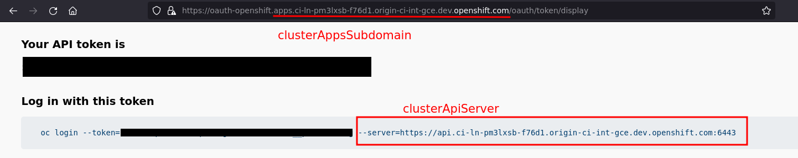
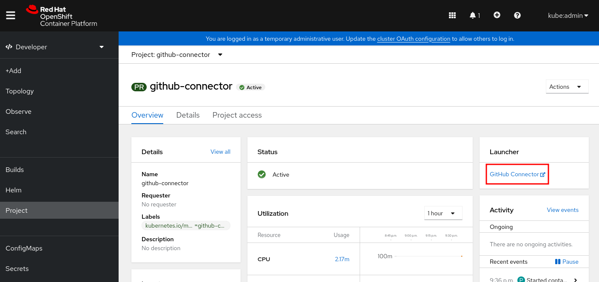

# OpenShift GitHub Connector

The OpenShift GitHub Connector provides a webapp on your OpenShift cluster which connects GitHub repositories to your OpenShift cluster, and automates setting up GitHub Actions for OpenShift.

## Installing on OpenShift
See [the chart](./chart/openshift-github-connector).
The inputs are described in [`values.yaml`](./chart/openshift-github-connector/values.yaml).

Install from the root of the repo as follows, while logged in as a cluster administrator:
```sh
oc create namespace github-connector
helm upgrade --install github-connector \
  chart/openshift-github-connector \
  --set clusterAppsSubdomain=apps.<your-openshift-server>.com \
  --set clusterApiServer=$(oc whoami --show-server)
```



If you are using CRC, you can omit the two `--set` statements, since the defaults are for CRC.

You need to be a cluster administrator to create an `OAuthClient` since it is a cluster-scoped resource.

See the [`values.yaml`](./chart/openshift-github-connector/values.yaml) for an explanation of these values and the others you may set.

The chart creates a Route through which the app can be accessed. The route host is `github-connector.<clusterAppsSubdomain>`. For example, for CRC, the host is `github-connector.apps-crc.testing`.

You can also access the frontend through navigating to the Developer perspective, selecting the `github-connector` project in the Projects list, and clicking **GitHub Connector** in the Launcher.



The route must be accessible from the internet, so GitHub can call back to it when the GitHub app is created.

## Developing
See [developing.md](./docs/developing.md).
